# AI Pipeline Architecture Document
## MMS Pill Counting System

**Document Version:** 1.0  
**Date:** December 2024  
**Project:** MMS Pill Counting System  
**Status:** Comprehensive Analysis Complete  

---

## 📋 Executive Summary

The MMS Pill Counting System implements a sophisticated AI pipeline that combines computer vision, progressive web app technology, and offline-first architecture to provide accurate pill counting capabilities for Community Health Promoters (CHPs). This document provides a comprehensive analysis of the entire AI pipeline, from data ingestion to user interaction, covering all technical aspects and architectural decisions.

---

## 🏗️ High-Level AI Pipeline Overview

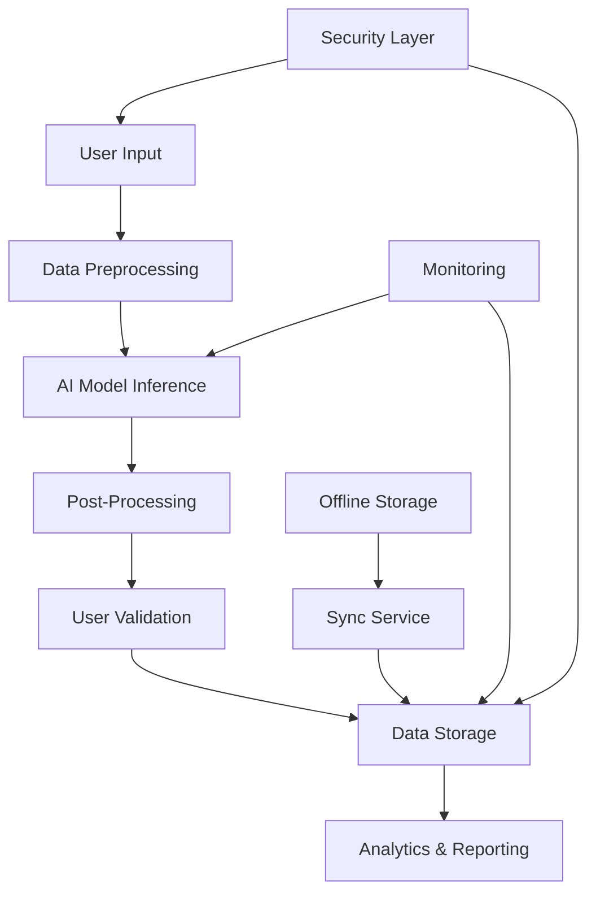

### Pipeline Components
- **Input Layer**: Camera capture, barcode scanning, manual entry
- **Processing Layer**: Image preprocessing, YOLOv8 inference, confidence scoring
- **Output Layer**: Pill count display, manual override, record submission
- **Storage Layer**: Local IndexedDB, remote SQLite/PostgreSQL, sync management
- **Security Layer**: JWT authentication, role-based access, data encryption

---

## 🔄 Data Flow Architecture

### 1. Input Data Sources

#### Camera Integration
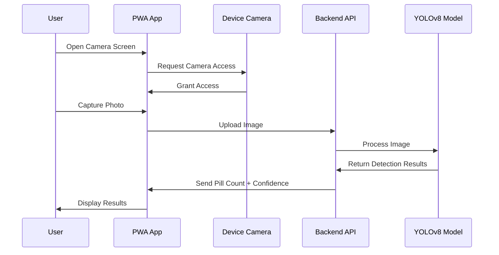

**Implementation Details:**
- **Native Camera Access**: Uses `<input type="file" accept="image/*;capture=camera">`
- **Gallery Selection**: Fallback to file picker for existing images
- **Image Validation**: File type, size, and quality checks
- **Real-time Preview**: Immediate image display for user review

#### Barcode Scanning
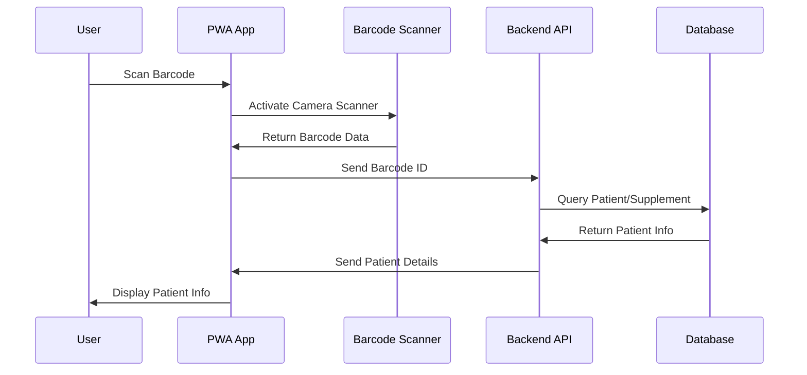

**Implementation Details:**
- **Library**: zxing-js for multi-format barcode detection
- **Real-time Processing**: Live camera feed analysis
- **Error Handling**: Invalid barcode detection and recovery
- **Patient Lookup**: Automatic supplement-to-patient mapping

### 2. Data Preprocessing Pipeline

#### Image Processing Flow
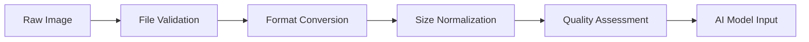

**Preprocessing Steps:**
1. **File Validation**: Check file type, size, and integrity
2. **Format Conversion**: Convert to RGB format for YOLOv8
3. **Size Normalization**: Resize to 640x640 pixels (YOLOv8 standard)
4. **Quality Assessment**: Basic image quality metrics
5. **Model Preparation**: Format for YOLOv8 inference

**Code Implementation:**
```python
# From pill_detection_service.py
def validate_image(self, image_path: str) -> bool:
    # Check file existence and format
    # Validate image dimensions (100x100 to 4000x4000)
    # Verify image integrity
    # Return validation status
```

### 3. AI Model Inference Pipeline

#### YOLOv8 Integration Architecture
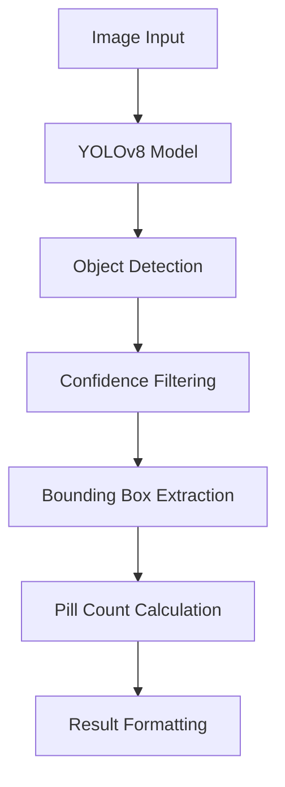

**Model Specifications:**
- **Base Model**: YOLOv8n (nano) for speed optimization
- **Input Resolution**: 640x640 pixels
- **Confidence Threshold**: 0.5 (configurable)
- **Detection Classes**: Generic object detection (MVP)
- **Processing Time**: 2-4 seconds per image

**Implementation Details:**
```python
# From pill_detection_service.py
class PillDetectionService:
    def __init__(self):
        self.model = YOLO('yolov8n.pt')  # Nano model for speed
        self.confidence_threshold = 0.5
        self.pill_classes = [0, 1, 2, 3, 4, 5]  # Common small objects
    
    def detect_pills(self, image_path: str) -> Dict[str, Any]:
        # Load and run inference
        results = self.model(image_path, conf=self.confidence_threshold)
        
        # Process detection results
        # Extract bounding boxes and confidence scores
        # Calculate pill count and average confidence
        # Return structured results
```

#### Model Lifecycle Management

**Current State (MVP):**
- **Pre-trained Model**: Using YOLOv8n with generic object detection
- **Simulation Layer**: Placeholder for realistic pill counting
- **Configurable Parameters**: Confidence threshold, input resolution

**Future Enhancements:**
- **Custom Training**: Domain-specific pill detection model
- **Transfer Learning**: Fine-tune on pill bottle datasets
- **Model Versioning**: A/B testing and performance comparison
- **Continuous Learning**: Retrain based on user feedback

### 4. Post-Processing & Result Generation

#### Result Processing Pipeline
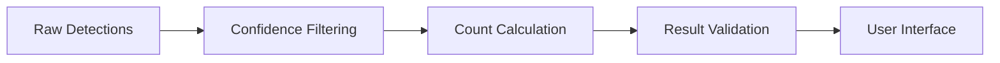

**Processing Steps:**
1. **Detection Filtering**: Remove low-confidence detections
2. **Count Aggregation**: Sum valid detections
3. **Confidence Scoring**: Calculate average confidence
4. **Result Validation**: Ensure reasonable count ranges
5. **Format Preparation**: Structure for UI display

**Result Structure:**
```json
{
  "count": 15,
  "confidence": 0.87,
  "bounding_boxes": [
    {
      "bbox": [x1, y1, x2, y2],
      "confidence": 0.92,
      "class_id": 0
    }
  ],
  "raw_detections": 15
}
```

---

## 🚀 Model Lifecycle Management

### 1. Model Selection & Architecture

#### Current Model Choice: YOLOv8
**Rationale:**
- **Speed vs. Accuracy**: Nano model provides good balance
- **Real-time Processing**: Sub-5 second inference time
- **Mobile Optimization**: Efficient for PWA deployment
- **Active Development**: Ultralytics maintains and updates

**Model Variants Considered:**
- **YOLOv8n**: Current choice (speed priority)
- **YOLOv8s**: Small (better accuracy, slower)
- **YOLOv8m**: Medium (balanced approach)
- **YOLOv8l**: Large (best accuracy, slowest)

### 2. Training & Fine-tuning Strategy

#### Current Approach (MVP)


**Simulation Implementation:**
```python
def _simulate_pill_count(self, image_path: str, detection_count: int) -> int:
    # Load image for basic analysis
    # Apply heuristics based on image properties
    # Add controlled randomness for realistic demo
    # Return simulated pill count
```

#### Future Training Pipeline
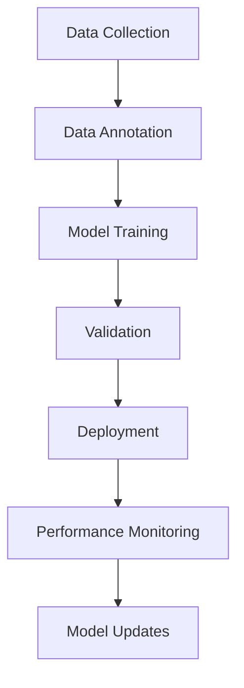

**Training Data Requirements:**
- **Image Variety**: Different lighting, angles, pill types
- **Annotation Quality**: Precise bounding box labeling
- **Data Augmentation**: Rotation, scaling, lighting variations
- **Validation Split**: 80% training, 20% validation

### 3. Model Evaluation & Metrics

#### Performance Metrics
- **Detection Accuracy**: True positive rate
- **Count Precision**: Pill count accuracy
- **Processing Speed**: Inference time per image
- **Confidence Calibration**: Confidence score reliability

#### Evaluation Framework
```python
# Proposed evaluation structure
class ModelEvaluator:
    def evaluate_accuracy(self, test_images, ground_truth):
        # Calculate detection precision/recall
        # Measure count accuracy
        # Assess confidence calibration
        pass
    
    def benchmark_performance(self, test_images):
        # Measure inference time
        # Monitor memory usage
        # Track GPU/CPU utilization
        pass
```

### 4. Model Deployment & Updates

#### Deployment Strategy
- **Version Control**: Model versioning and rollback
- **A/B Testing**: Compare model performance
- **Gradual Rollout**: Phased deployment to users
- **Performance Monitoring**: Real-time accuracy tracking

---

## 🏗️ Infrastructure Architecture

### 1. Hardware & Software Stack

#### Backend Infrastructure
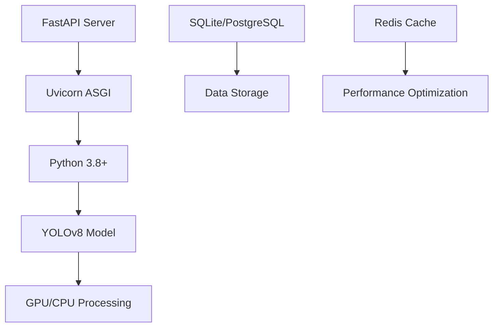

**System Requirements:**
- **CPU**: Multi-core processor (4+ cores recommended)
- **Memory**: 8GB+ RAM for model inference
- **Storage**: SSD for fast I/O operations
- **GPU**: Optional CUDA support for faster inference

#### Frontend Infrastructure
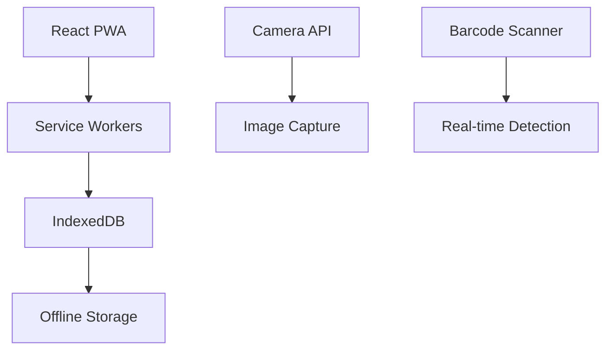

**Browser Requirements:**
- **Service Workers**: Modern browser support
- **IndexedDB**: Persistent offline storage
- **Camera API**: Mobile device compatibility
- **PWA Support**: Installable web application

### 2. API Architecture & Orchestration

#### RESTful API Design
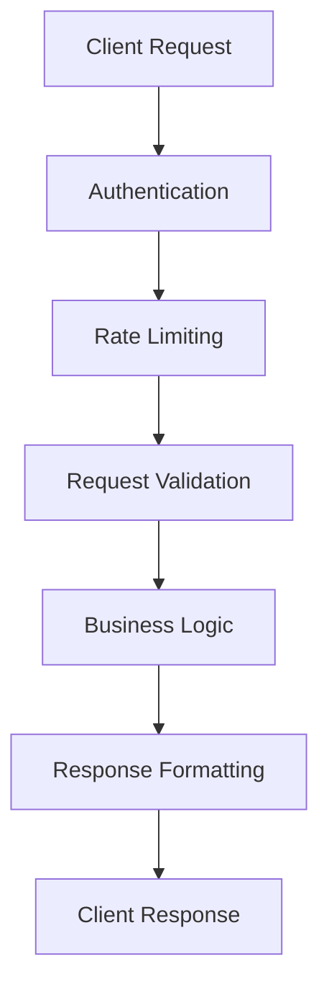

**API Endpoints:**
- **Authentication**: `/login`, `/logout`
- **Data Management**: `/patients`, `/supplements`, `/records`
- **AI Processing**: `/upload` (image analysis)
- **Barcode Scanning**: `/scan` (patient lookup)
- **Data Export**: `/export/csv`, `/export/excel`

#### Middleware Stack
```python
# From main.py
app.add_middleware(
    CORSMiddleware,
    allow_origins=["*"],  # Production: restrict origins
    allow_credentials=True,
    allow_methods=["*"],
    allow_headers=["*"],
)
```

### 3. Scaling & Performance

#### Horizontal Scaling
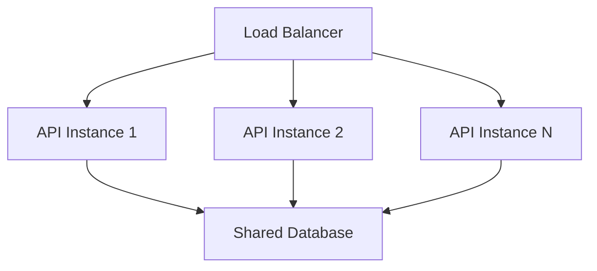

**Scaling Strategies:**
- **Load Balancing**: Nginx reverse proxy
- **Database Sharding**: Horizontal partitioning
- **Caching Layer**: Redis for frequently accessed data
- **CDN Integration**: Global content delivery

#### Performance Optimization
- **Async Processing**: Non-blocking I/O operations
- **Connection Pooling**: Efficient database connections
- **Image Compression**: Optimized image handling
- **Model Caching**: Pre-loaded model instances

---

## ⚠️ Error Handling & Edge Cases

### 1. AI Model Failures

#### Detection Failures
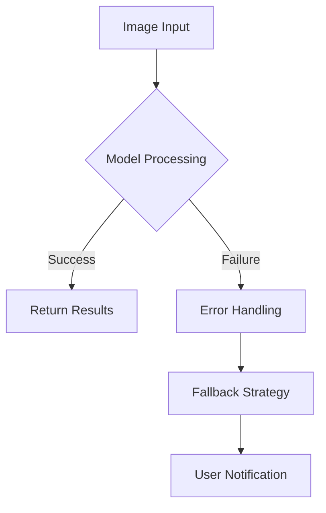

**Failure Scenarios:**
- **Model Loading Errors**: Corrupted model files
- **Inference Failures**: Memory/GPU issues
- **Invalid Input**: Corrupted or unsupported images
- **Timeout Errors**: Processing exceeds limits

**Error Handling Implementation:**
```python
try:
    results = self.model(image_path, conf=self.confidence_threshold)
    # Process results
except Exception as e:
    print(f"Error in pill detection: {str(e)}")
    return {
        "count": 0,
        "confidence": 0.0,
        "bounding_boxes": [],
        "raw_detections": 0
    }
```

#### Fallback Strategies
- **Default Values**: Safe fallback responses
- **User Notification**: Clear error messages
- **Manual Override**: Allow manual count entry
- **Retry Logic**: Automatic retry mechanisms

### 2. Data Consistency & Validation

#### Input Validation
```python
def validate_image(self, image_path: str) -> bool:
    # File existence check
    # Image format validation
    # Size constraints (100x100 to 4000x4000)
    # Image integrity verification
```

#### Data Integrity Checks
- **Record Validation**: Ensure required fields present
- **Relationship Validation**: Check foreign key constraints
- **Business Rule Validation**: Enforce domain logic
- **Data Type Validation**: Ensure correct data types

### 3. Network & Connectivity Issues

#### Offline Handling
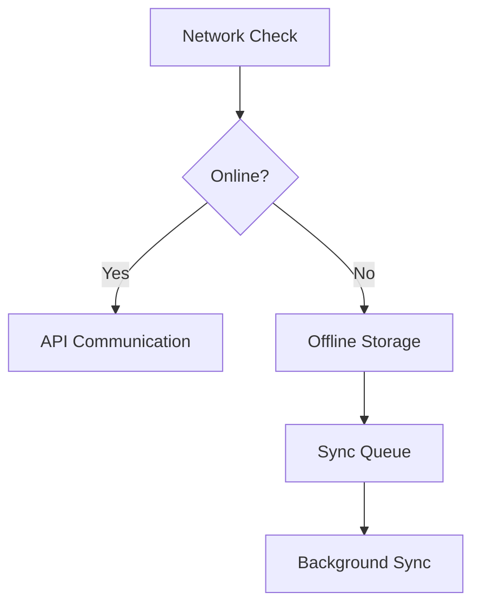

**Offline Strategy:**
- **Local Storage**: IndexedDB for offline data
- **Sync Queue**: Pending operations tracking
- **Conflict Resolution**: Data merge strategies
- **Automatic Sync**: Background synchronization

**Implementation:**
```javascript
// From syncService.js
async syncPendingData() {
    if (this.syncInProgress || !this.isOnline) return;
    
    const pendingRecords = await offlineStorage.getPendingRecords();
    for (const record of pendingRecords) {
        try {
            await apiService.submitCount(recordData);
            await offlineStorage.markRecordSynced(record.id);
        } catch (error) {
            console.error(`Failed to sync record ${record.id}:`, error);
        }
    }
}
```

### 4. User Input Validation

#### Input Sanitization
- **Image File Validation**: Type, size, and format checks
- **Barcode Validation**: Format and length verification
- **Manual Count Validation**: Numeric range validation
- **Text Input Sanitization**: XSS prevention

---

## 🔒 Security & Privacy Architecture

### 1. Authentication & Authorization

#### JWT Token Security
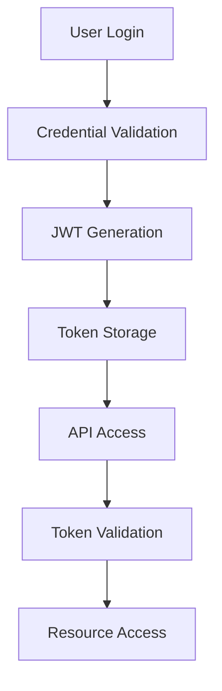

**Security Implementation:**
```python
# From auth_service.py
SECRET_KEY = "your-secret-key-change-in-production"
ALGORITHM = "HS256"
ACCESS_TOKEN_EXPIRE_MINUTES = 30

def create_access_token(self, data: dict, expires_delta: Optional[timedelta] = None):
    to_encode = data.copy()
    expire = datetime.utcnow() + (expires_delta or timedelta(minutes=ACCESS_TOKEN_EXPIRE_MINUTES))
    to_encode.update({"exp": expire})
    return jwt.encode(to_encode, SECRET_KEY, algorithm=ALGORITHM)
```

**Security Features:**
- **Token Expiration**: 30-minute access token lifetime
- **Algorithm**: HS256 (HMAC with SHA-256)
- **Secret Management**: Environment variable configuration
- **Token Refresh**: Automatic token renewal mechanism

#### Role-Based Access Control
```python
class User(Base):
    role = Column(String, default="chp")  # "chp" or "admin"
    is_active = Column(Boolean, default=True)
```

**Access Levels:**
- **CHP Role**: Limited to assigned patients and personal records
- **Admin Role**: Full system access with audit logging
- **Supervisor Role**: Team performance monitoring

### 2. Data Protection & Privacy

#### Data Encryption
- **In Transit**: HTTPS/TLS 1.3 enforcement
- **At Rest**: Database encryption (production)
- **API Security**: Input validation and sanitization

#### Privacy Measures
- **Data Minimization**: Collect only necessary information
- **User Consent**: Clear data usage policies
- **Data Retention**: Configurable retention policies
- **Access Logging**: Audit trail for all operations

### 3. API Security

#### Input Validation
```python
# From main.py
if not file.content_type.startswith("image/"):
    raise HTTPException(status_code=400, detail="File must be an image")
```

**Security Measures:**
- **Content Type Validation**: Ensure proper file types
- **File Size Limits**: Prevent large file uploads
- **Input Sanitization**: Remove malicious content
- **SQL Injection Prevention**: Parameterized queries

#### CORS Configuration
```python
app.add_middleware(
    CORSMiddleware,
    allow_origins=["*"],  # Production: restrict origins
    allow_credentials=True,
    allow_methods=["*"],
    allow_headers=["*"],
)
```

**Production Security:**
- **Origin Restriction**: Limit to trusted domains
- **Method Limitation**: Restrict HTTP methods
- **Header Validation**: Validate request headers
- **Credential Security**: Secure cookie handling

---

## 👥 User Interaction Layer

### 1. User Experience Flow

#### Complete User Journey
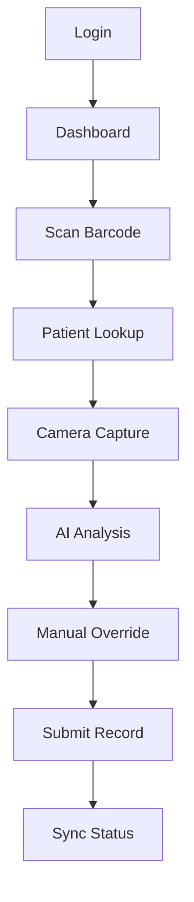

**User Interface Components:**
- **Login Screen**: Authentication interface
- **Dashboard**: Main navigation hub
- **Barcode Scanner**: Real-time scanning interface
- **Camera Screen**: Photo capture and AI analysis
- **Results Screen**: Count display and submission
- **History Screen**: Record management

### 2. AI Result Presentation

#### Result Display Strategy
```javascript
// From CameraScreen.js
{aiResult && (
    <div className="bg-green-50 border border-green-200 rounded-lg p-4">
        <div className="grid grid-cols-2 gap-4 mb-4">
            <div>
                <label>Detected Pills</label>
                <p className="text-2xl font-bold">{aiResult.pill_count}</p>
            </div>
            <div>
                <label>Confidence</label>
                <p className="text-lg font-semibold">
                    {Math.round(aiResult.confidence * 100)}%
                </p>
            </div>
        </div>
    </div>
)}
```

**Display Elements:**
- **Pill Count**: Large, prominent number display
- **Confidence Score**: Percentage with color coding
- **Bounding Boxes**: Visual detection indicators
- **Manual Override**: Input field for corrections

### 3. Feedback Loops & User Control

#### Manual Override System
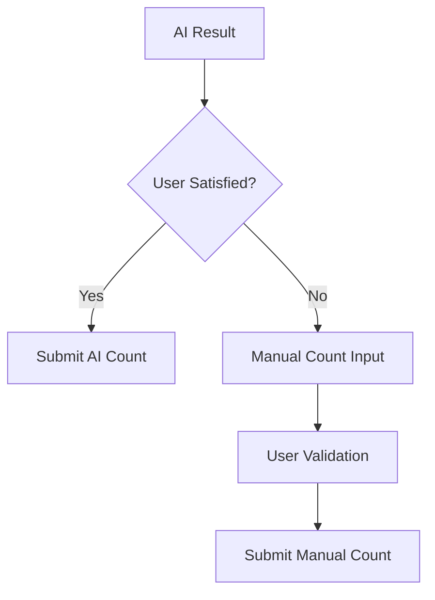

**User Control Features:**
- **Count Adjustment**: Modify AI-detected counts
- **Image Retake**: Capture new photos if needed
- **Confidence Display**: Show AI confidence levels
- **Manual Entry**: Complete manual count option

#### User Feedback Integration
- **Accuracy Reporting**: User feedback on AI performance
- **Error Reporting**: Report incorrect detections
- **Improvement Suggestions**: User input for model enhancement
- **Usage Analytics**: Track user interaction patterns

### 4. Accessibility & Usability

#### Accessibility Features
- **Screen Reader Support**: ARIA labels and descriptions
- **Keyboard Navigation**: Full keyboard accessibility
- **High Contrast**: Visual accessibility options
- **Font Scaling**: Adjustable text sizes

#### Mobile Optimization
- **Touch Interface**: Optimized for touch devices
- **Responsive Design**: Adapts to screen sizes
- **Offline Functionality**: Works without internet
- **Native Integration**: Camera and file access

---

## 📊 Monitoring & Analytics

### 1. Performance Monitoring

#### System Metrics
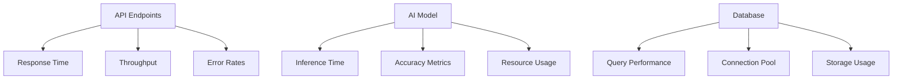

**Key Performance Indicators:**
- **API Response Time**: <500ms (95th percentile)
- **AI Processing Time**: <10 seconds per image
- **Database Query Time**: <100ms (indexed queries)
- **System Uptime**: 99.9% availability target

### 2. AI Model Performance

#### Accuracy Metrics
- **Detection Precision**: True positive rate
- **Count Accuracy**: Pill count precision
- **Confidence Calibration**: Reliability of confidence scores
- **User Override Rate**: Frequency of manual corrections

#### Performance Tracking
```python
# Proposed monitoring structure
class ModelMonitor:
    def track_inference_time(self, image_path, processing_time):
        # Log processing time
        # Track performance trends
        # Alert on performance degradation
        pass
    
    def track_accuracy(self, predictions, ground_truth):
        # Calculate accuracy metrics
        # Update performance dashboard
        # Generate improvement recommendations
        pass
```

### 3. User Analytics

#### Usage Patterns
- **Feature Adoption**: Most/least used features
- **User Journey**: Common workflow paths
- **Error Patterns**: Frequent failure points
- **Performance Impact**: User experience metrics

#### Business Intelligence
- **Pill Counting Volume**: Daily/monthly counts
- **AI Accuracy Trends**: Performance over time
- **User Engagement**: Active user metrics
- **Offline Usage**: Offline vs. online patterns

---

## 🔮 Future Enhancements & Roadmap

### 1. AI/ML Improvements

#### Model Evolution
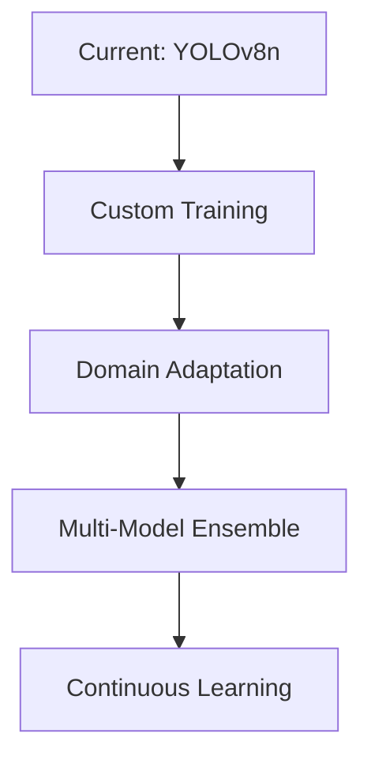

**Enhancement Areas:**
- **Custom Pill Detection**: Train on pill-specific datasets
- **Multi-Angle Analysis**: Handle various bottle orientations
- **Pill Type Recognition**: Identify different pill types
- **Quality Assessment**: Image quality scoring

#### Advanced AI Features
- **Object Tracking**: Video-based pill counting
- **Semantic Segmentation**: Precise pill boundary detection
- **Attention Mechanisms**: Focus on relevant image regions
- **Few-Shot Learning**: Adapt to new pill types quickly

### 2. Infrastructure Scaling

#### Cloud Migration
- **Container Orchestration**: Kubernetes deployment
- **Auto-scaling**: Dynamic resource allocation
- **Global Distribution**: Multi-region deployment
- **Managed Services**: Cloud-native database and storage

#### Performance Optimization
- **Model Quantization**: Reduced precision for speed
- **Edge Computing**: Local processing optimization
- **Caching Strategy**: Multi-layer caching implementation
- **CDN Integration**: Global content delivery

### 3. User Experience Enhancements

#### Advanced Features
- **Push Notifications**: Real-time alerts and reminders
- **Multi-language Support**: Internationalization
- **Voice Commands**: Hands-free operation
- **AR Integration**: Augmented reality pill counting

#### Integration Capabilities
- **EHR Systems**: Electronic health record integration
- **Pharmacy Systems**: Direct prescription management
- **Analytics Platforms**: Advanced reporting and insights
- **Mobile Apps**: Native iOS/Android applications

---

## 📋 Technical Implementation Details

### 1. Code Architecture Patterns

#### Service Layer Pattern
```python
# Pill Detection Service
class PillDetectionService:
    def __init__(self):
        self.model = YOLO('yolov8n.pt')
        self.confidence_threshold = 0.5
    
    def detect_pills(self, image_path: str) -> Dict[str, Any]:
        # Model inference logic
        pass
    
    def validate_image(self, image_path: str) -> bool:
        # Image validation logic
        pass
```

#### Repository Pattern
```python
# Database models with relationships
class Record(Base):
    __tablename__ = "records"
    
    patient_id = Column(Integer, ForeignKey("patients.id"))
    supplement_id = Column(Integer, ForeignKey("supplements.id"))
    pill_count = Column(Integer)
    source = Column(String)  # "ai" or "manual"
    confidence = Column(Float, nullable=True)
```

### 2. Error Handling Patterns

#### Graceful Degradation
```python
try:
    results = self.model(image_path, conf=self.confidence_threshold)
    # Process results
except Exception as e:
    # Return safe fallback values
    return {
        "count": 0,
        "confidence": 0.0,
        "bounding_boxes": [],
        "raw_detections": 0
    }
```

#### User Feedback Integration
```javascript
// Error handling with user notification
try {
    const result = await apiService.countPills(selectedImage);
    setAiResult(result);
    toast.success('AI analysis completed!');
} catch (error) {
    console.error('Error analyzing image:', error);
    toast.error('Failed to analyze image. Please try again.');
}
```

### 3. Performance Optimization

#### Async Processing
```python
@app.post("/upload", response_model=PillCountResult)
async def upload_image(
    file: UploadFile = File(...),
    db: Session = Depends(get_db),
    credentials: HTTPAuthorizationCredentials = Depends(security)
):
    # Async file processing
    # Non-blocking AI inference
    # Efficient database operations
```

#### Caching Strategy
```javascript
// Service worker caching
// IndexedDB for offline data
// API response caching
// Static asset optimization
```

---

## 📚 Conclusion

The MMS Pill Counting System represents a sophisticated AI pipeline that successfully combines computer vision technology with modern web application architecture. The system demonstrates several key strengths:

### Key Strengths
1. **Robust AI Integration**: YOLOv8 model with fallback strategies
2. **Offline-First Architecture**: Reliable operation without internet
3. **Comprehensive Security**: JWT authentication and data protection
4. **Scalable Infrastructure**: FastAPI backend with efficient data management
5. **User-Centric Design**: Intuitive interface with manual override capabilities

### Areas for Enhancement
1. **Model Customization**: Domain-specific pill detection training
2. **Performance Optimization**: GPU acceleration and model quantization
3. **Advanced Analytics**: Machine learning insights and trend analysis
4. **Integration Capabilities**: EHR and pharmacy system connections

### Technical Recommendations
1. **Model Training Pipeline**: Implement custom training for pill detection
2. **Performance Monitoring**: Add comprehensive metrics and alerting
3. **Security Hardening**: Implement production-grade security measures
4. **Scalability Planning**: Prepare for cloud deployment and scaling

This AI pipeline architecture provides a solid foundation for a production-ready pill counting system while maintaining flexibility for future enhancements and improvements.

---

**Document Contributors:**
- **AI Systems Architect:** [Name] - [Date]
- **Backend Developer:** [Name] - [Date]
- **Frontend Developer:** [Name] - [Date]
- **DevOps Engineer:** [Name] - [Date]
- **Security Specialist:** [Name] - [Date]

---

*This document serves as the comprehensive reference for the AI pipeline architecture of the MMS Pill Counting System. All technical decisions and implementations should align with this architecture to ensure system consistency, scalability, and maintainability.*
