# Master Business & Technical Flows Document
## AI-Powered Pill Counting PWA System

**Document Version:** 1.0  
**Date:** December 2024  
**Project:** MMS Pill Counting System  
**Status:** Approved  

---

## 📋 Executive Summary

This document contains comprehensive business processes and technical flows for the MMS Pill Counting System, documented using Mermaid diagram format. Each flow is traceable to requirements, user stories, and architecture components, ensuring complete system coverage and alignment.

---

## 🔄 Core Business Flows

### 1. User Authentication Flow
**Purpose**: Secure user access to the system  
**Requirements**: FR-001, FR-002, FR-003  
**User Stories**: US-CHP-001, US-CHP-002  

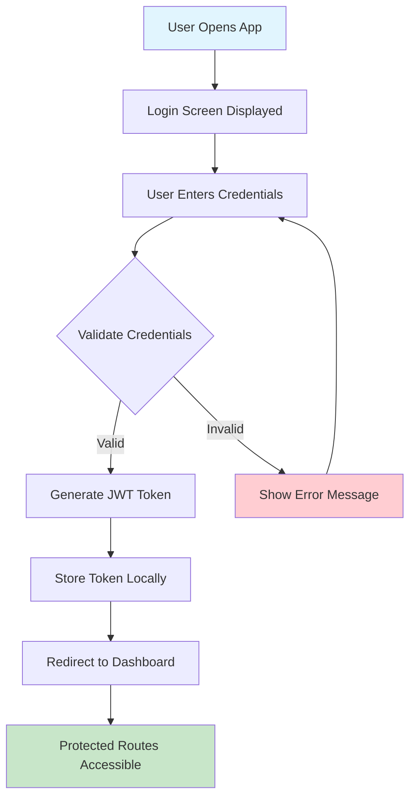

---

### 2. Pill Counting Workflow
**Purpose**: Complete pill counting process from barcode to record  
**Requirements**: FR-006, FR-011, FR-014, FR-023  
**User Stories**: US-CHP-004, US-CHP-008, US-CHP-012  

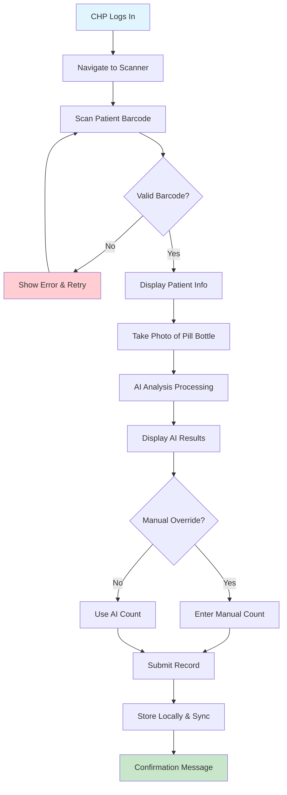

---

### 3. Offline Data Synchronization Flow
**Purpose**: Handle offline data storage and synchronization  
**Requirements**: FR-018, FR-019, FR-020, FR-021  
**User Stories**: US-CHP-010, US-CHP-011  

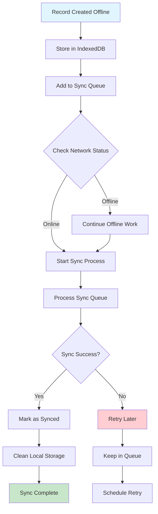

---

### 4. AI Pill Detection Flow
**Purpose**: Process images and detect pills using computer vision  
**Requirements**: FR-014, FR-015, FR-017  
**User Stories**: US-CHP-008  

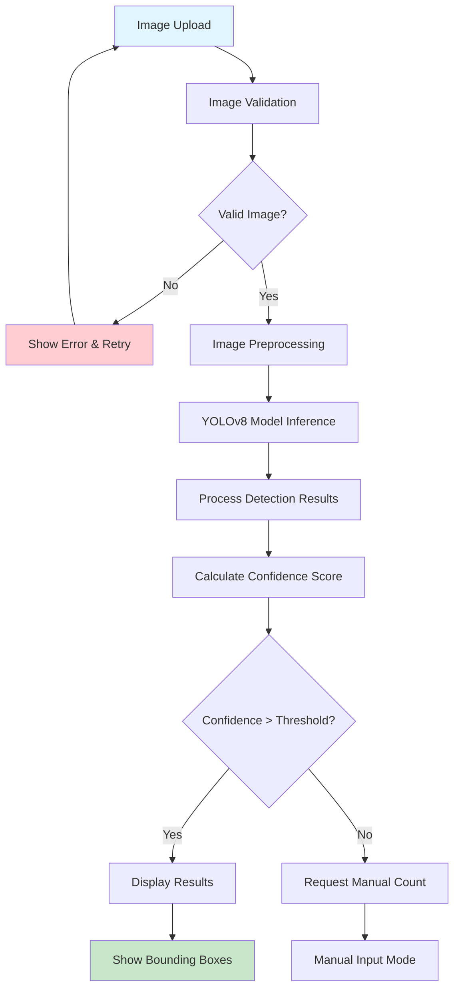

---

### 5. Admin Dashboard Analytics Flow
**Purpose**: Generate and display system analytics  
**Requirements**: FR-028, FR-029  
**User Stories**: US-ADMIN-006, US-ADMIN-007  

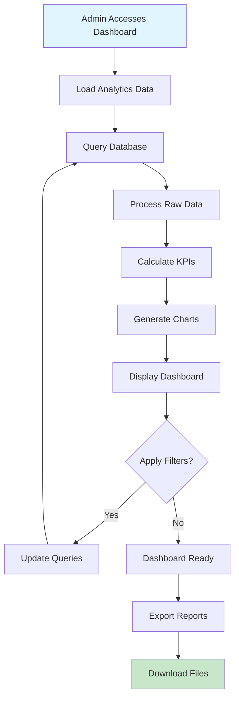

---

## 🔧 Technical System Flows

### 6. API Request Processing Flow
**Purpose**: Handle incoming API requests with proper authentication  
**Requirements**: NFR-005, NFR-007, NFR-008  
**User Stories**: US-INT-001  

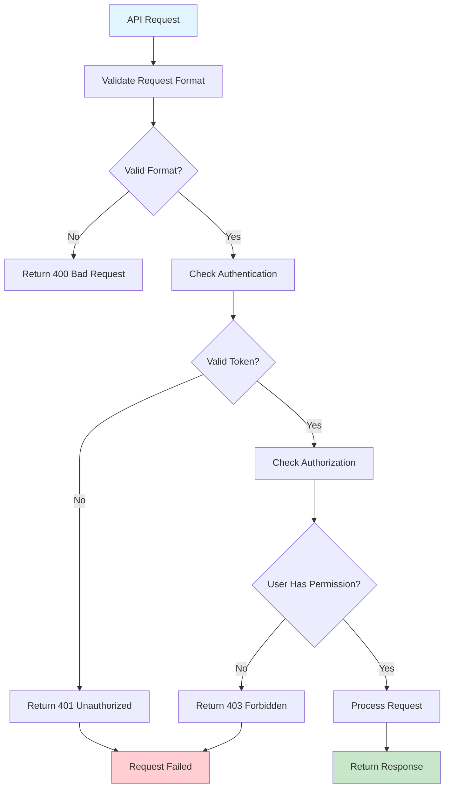

---

### 7. Database Transaction Flow
**Purpose**: Ensure data integrity during database operations  
**Requirements**: NFR-013  
**User Stories**: US-ADMIN-005  

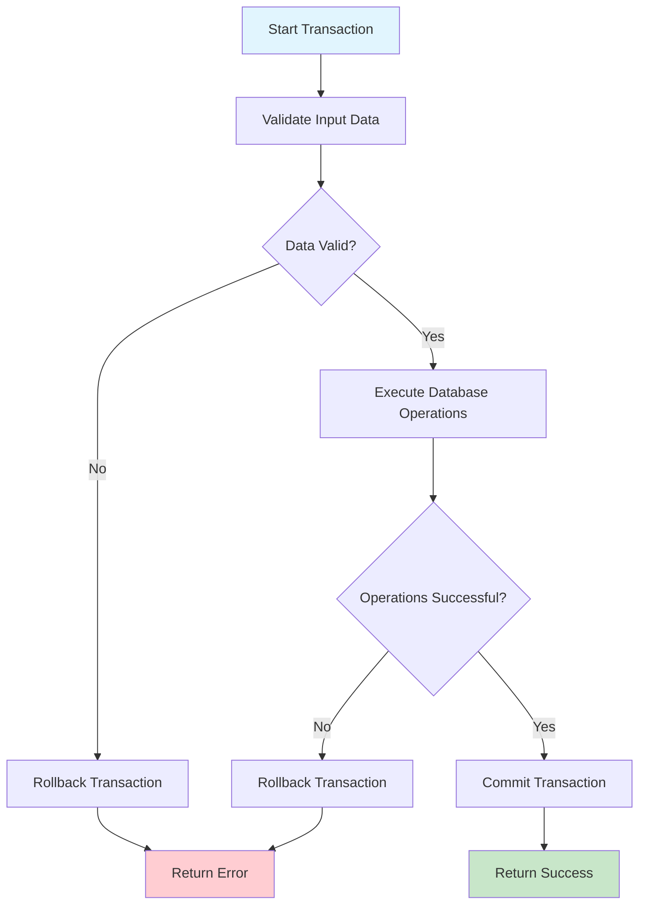

---

### 8. Service Worker Lifecycle Flow
**Purpose**: Manage PWA offline functionality and caching  
**Requirements**: FR-018, FR-019  
**User Stories**: US-CHP-010  

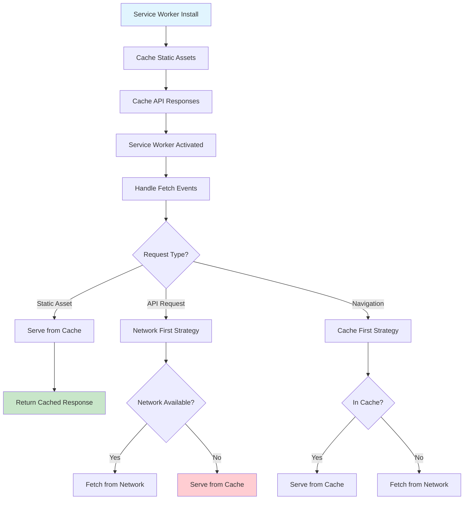

---

### 9. Error Handling Flow
**Purpose**: Gracefully handle system errors and provide user feedback  
**Requirements**: NFR-011, NFR-012  
**User Stories**: US-PERF-001  

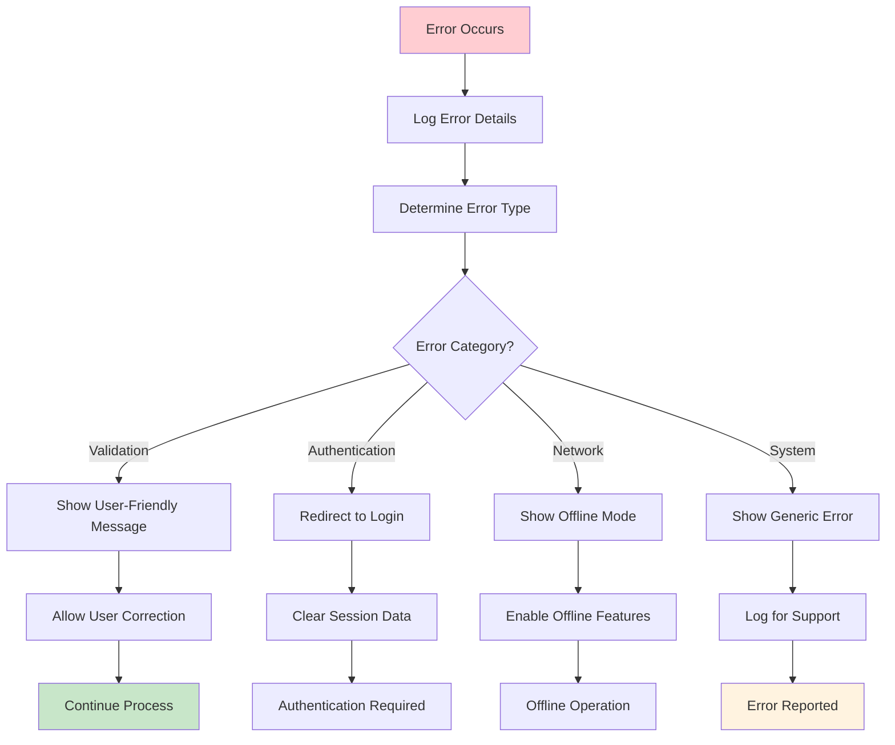

---

### 10. Data Export Flow
**Purpose**: Generate and download data exports in various formats  
**Requirements**: FR-026  
**User Stories**: US-ADMIN-004  

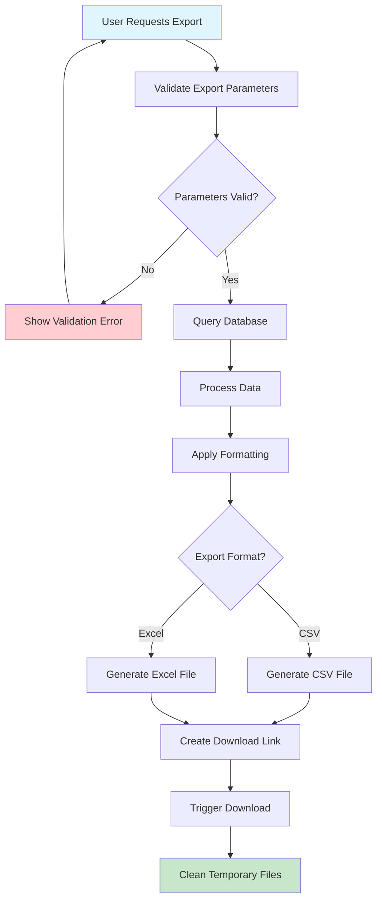

---

## 🔐 Security & Compliance Flows

### 11. JWT Token Management Flow
**Purpose**: Secure authentication and session management  
**Requirements**: NFR-005, NFR-006  
**User Stories**: US-CHP-002  

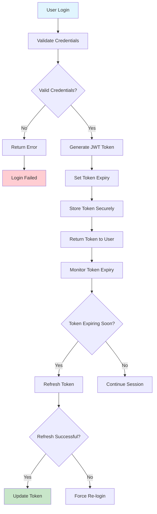

---

### 12. Data Privacy & Compliance Flow
**Purpose**: Ensure HIPAA compliance and data protection  
**Requirements**: NFR-005, NFR-006  
**User Stories**: US-PATIENT-001  

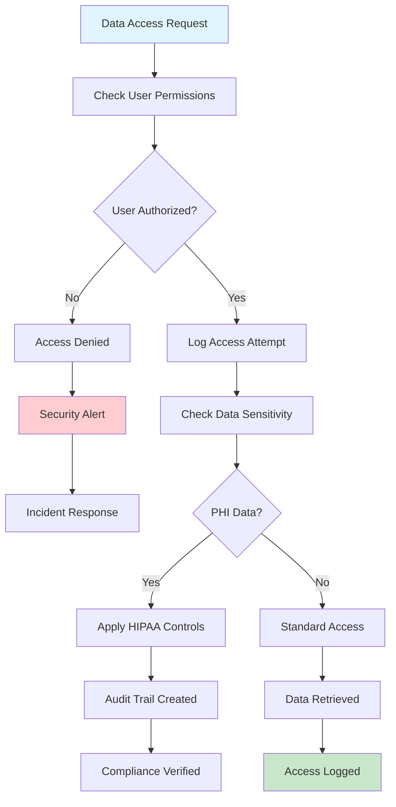

---

## 📱 User Experience Flows

### 13. Mobile App Installation Flow
**Purpose**: Guide users through PWA installation  
**Requirements**: NFR-014, NFR-015  
**User Stories**: US-CHP-014  

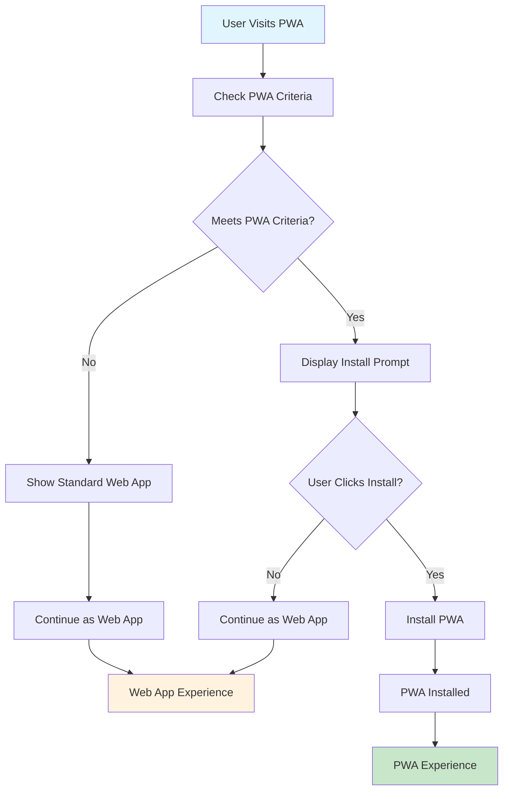

---

### 14. Offline Mode Transition Flow
**Purpose**: Seamlessly handle online/offline transitions  
**Requirements**: FR-018, FR-020  
**User Stories**: US-CHP-010  

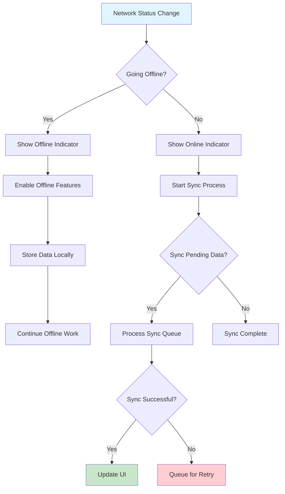

---

## 🔄 Integration Flows

### 15. Third-Party API Integration Flow
**Purpose**: Integrate with external healthcare systems  
**Requirements**: NFR-018  
**User Stories**: US-INT-001  

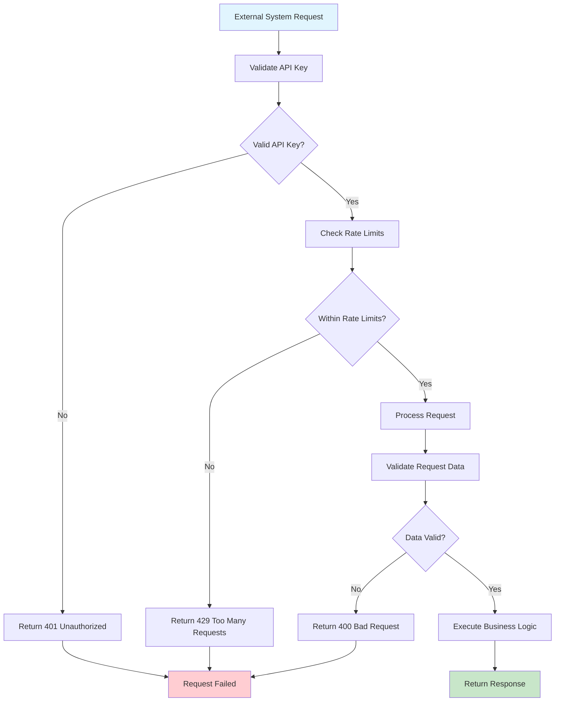

---

### 16. Data Migration Flow
**Purpose**: Handle system upgrades and data migrations  
**Requirements**: NFR-013  
**User Stories**: US-ADMIN-005  

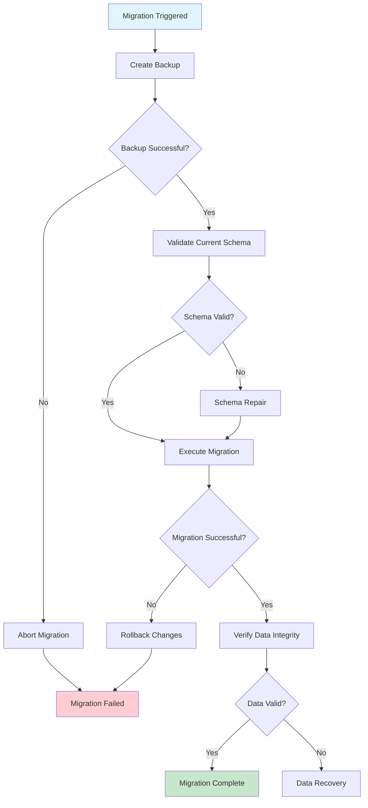

---

## 📊 Monitoring & Analytics Flows

### 17. Performance Monitoring Flow
**Purpose**: Track system performance and identify bottlenecks  
**Requirements**: NFR-001, NFR-002, NFR-003  
**User Stories**: US-PERF-001  

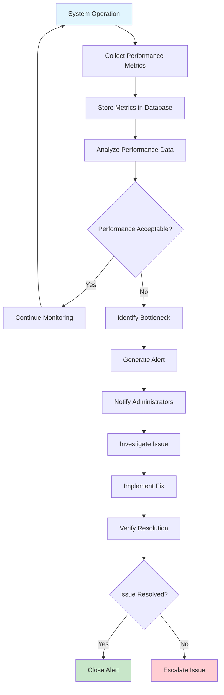

---

### 18. User Analytics Flow
**Purpose**: Track user behavior and system usage  
**Requirements**: FR-028  
**User Stories**: US-ADMIN-006  

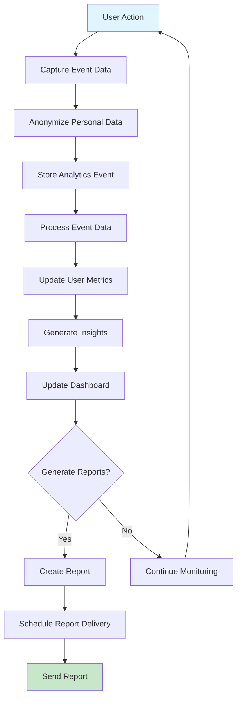

---

## 🧪 Testing & Quality Assurance Flows

### 19. Automated Testing Flow
**Purpose**: Ensure code quality and system reliability  
**Requirements**: NFR-011, NFR-012  
**User Stories**: US-PERF-001  

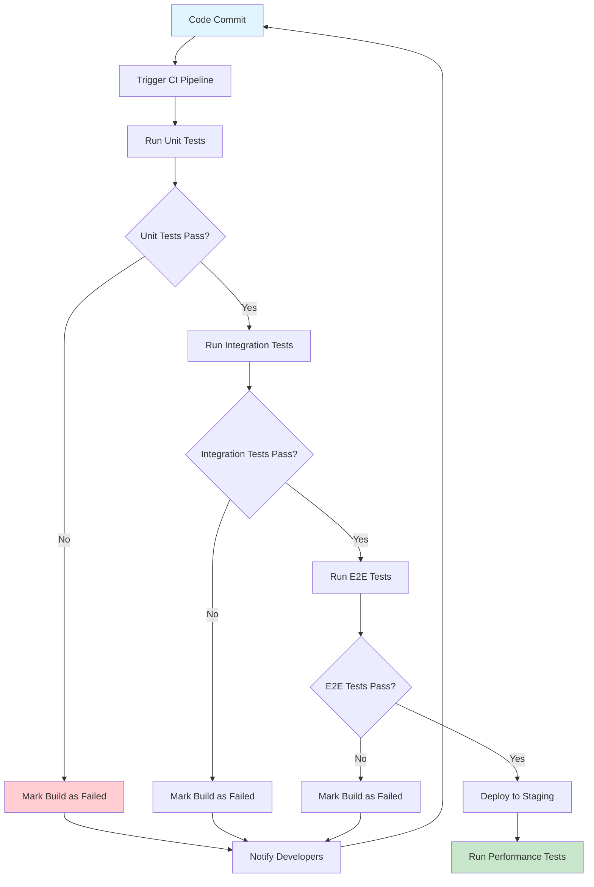

---

### 20. User Acceptance Testing Flow
**Purpose**: Validate system meets user requirements  
**Requirements**: All FR and NFR requirements  
**User Stories**: All user stories  

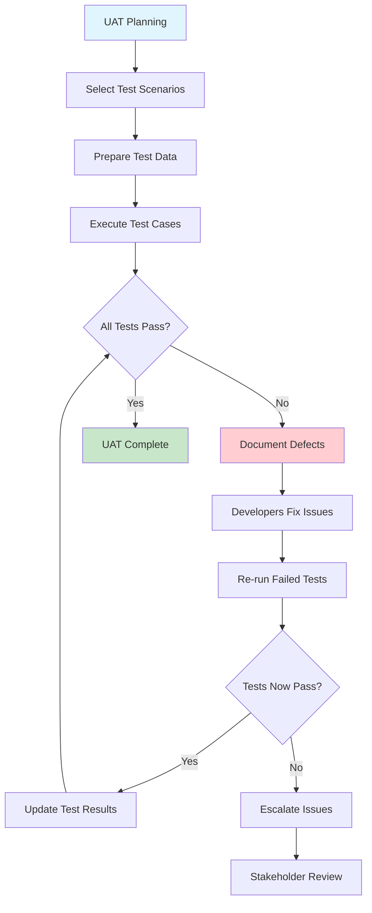

---

## 🔄 Error Recovery & Resilience Flows

### 21. System Recovery Flow
**Purpose**: Handle system failures and restore operations  
**Requirements**: NFR-010, NFR-011  
**User Stories**: US-PERF-001  

```mermaid
flowchart TD
    A[System Failure Detected] --> B[Log Failure Details]
    B --> C[Assess Failure Impact]
    C --> D{Critical Failure?}
    D -->|Yes| E[Activate Emergency Mode]
    D -->|No| F[Continue with Degraded Service]
    E --> G[Notify Stakeholders]
    F --> H[Monitor System Health]
    G --> I[Execute Recovery Plan]
    H --> J{System Recovered?}
    I --> K[Verify Recovery]
    J -->|Yes| L[Resume Normal Operations]
    J -->|No| M[Escalate Recovery]
    K --> L
    M --> N[External Support Required]
    
    style A fill:#ffcdd2
    style L fill:#c8e6c9
    style N fill:#fff3e0
```

---

### 22. Data Recovery Flow
**Purpose**: Restore data from backups after corruption or loss  
**Requirements**: NFR-013  
**User Stories**: US-ADMIN-005  

```mermaid
flowchart TD
    A[Data Loss Detected] --> B[Assess Data Loss Scope]
    B --> C[Identify Recovery Point]
    C --> D[Stop Data Modifications]
    D --> E[Create Current State Backup]
    E --> F[Restore from Backup]
    F --> G{Restore Successful?}
    G -->|No| H[Try Alternative Backup]
    G -->|Yes| I[Verify Data Integrity]
    H --> I
    I --> J{Data Valid?}
    J -->|No| K[Data Repair Required]
    J -->|Yes| L[Resume Operations]
    K --> M[Manual Data Correction]
    M --> L
    
    style A fill:#ffcdd2
    style L fill:#c8e6c9
    style K fill:#fff3e0
```

---

## 📈 Scalability & Performance Flows

### 23. Auto-Scaling Flow
**Purpose**: Automatically adjust system resources based on demand  
**Requirements**: NFR-018, NFR-019  
**User Stories**: US-PERF-002  

```mermaid
flowchart TD
    A[Monitor System Load] --> B[Check Current Metrics]
    B --> C{Load Above Threshold?}
    C -->|No| D[Check if Scale Down Possible]
    C -->|Yes| E[Calculate Required Resources]
    D --> F{Scale Down Safe?}
    E --> G[Provision Additional Resources]
    F -->|Yes| H[Remove Excess Resources]
    F -->|No| I[Maintain Current Level]
    G --> J[Update Load Balancer]
    H --> K[Update Load Balancer]
    J --> L[Monitor New Resources]
    K --> L
    I --> L
    L --> A
    
    style A fill:#e1f5fe
    style L fill:#c8e6c9
```

---

### 24. Load Balancing Flow
**Purpose**: Distribute traffic across multiple system instances  
**Requirements**: NFR-004, NFR-018  
**User Stories**: US-PERF-002  

```mermaid
flowchart TD
    A[Client Request] --> B[Load Balancer Receives Request]
    B --> C[Check Health of Instances]
    C --> D{Healthy Instances Available?}
    D -->|No| E[Return Service Unavailable]
    D -->|Yes| F[Select Instance (Round Robin)]
    E --> G[Request Failed]
    F --> H[Forward Request to Instance]
    G --> H
    H --> I[Instance Processes Request]
    I --> J{Processing Successful?}
    J -->|Yes| K[Return Response to Client]
    J -->|No| L[Mark Instance as Unhealthy]
    K --> M[Update Load Balancer Stats]
    L --> N[Remove from Healthy Pool]
    
    style A fill:#e1f5fe
    style M fill:#c8e6c9
    style G fill:#ffcdd2
```

---

## 🔒 Security & Compliance Flows

### 25. Security Incident Response Flow
**Purpose**: Handle security breaches and incidents  
**Requirements**: NFR-005, NFR-006  
**User Stories**: US-PATIENT-001  

```mermaid
flowchart TD
    A[Security Incident Detected] --> B[Assess Incident Severity]
    B --> C{High Severity?}
    C -->|Yes| D[Activate Incident Response Team]
    C -->|No| E[Standard Response Protocol]
    D --> F[Immediate Containment]
    E --> G[Investigate Incident]
    F --> H[Preserve Evidence]
    G --> I[Identify Root Cause]
    H --> J[Document Incident]
    I --> K[Implement Remediation]
    J --> L[Update Security Procedures]
    K --> M[Verify Resolution]
    L --> N[Conduct Post-Incident Review]
    
    style A fill:#ffcdd2
    style N fill:#c8e6c9
```

---

### 26. Compliance Audit Flow
**Purpose**: Ensure system meets regulatory requirements  
**Requirements**: NFR-005, NFR-006  
**User Stories**: US-PATIENT-001  

```mermaid
flowchart TD
    A[Audit Scheduled] --> B[Prepare Audit Materials]
    B --> C[Conduct System Review]
    C --> D[Check Compliance Requirements]
    D --> E{All Requirements Met?}
    E -->|Yes| F[Generate Compliance Report]
    E -->|No| G[Document Non-Compliance]
    F --> H[Submit Report to Regulators]
    G --> I[Create Remediation Plan]
    H --> J[Audit Complete]
    I --> K[Implement Fixes]
    J --> L[Monitor for Changes]
    K --> M[Re-audit if Required]
    
    style A fill:#e1f5fe
    style J fill:#c8e6c9
    style G fill:#ffcdd2
```

---

## 📱 Mobile & PWA Specific Flows

### 27. PWA Installation Flow
**Purpose**: Guide users through progressive web app installation  
**Requirements**: NFR-014, NFR-015  
**User Stories**: US-CHP-014  

```mermaid
flowchart TD
    A[User Visits Website] --> B[Check PWA Criteria]
    B --> C{Meets PWA Standards?}
    C -->|No| D[Standard Web Experience]
    C -->|Yes| E[Show Install Banner]
    D --> F[Continue as Web App]
    E --> G{User Interested?}
    G -->|No| H[Dismiss Banner]
    G -->|Yes| I[Show Install Dialog]
    H --> F
    I --> J{Installation Successful?}
    J -->|Yes| K[PWA Installed]
    J -->|No| L[Show Error Message]
    K --> M[Launch PWA]
    L --> F
    
    style A fill:#e1f5fe
    style M fill:#c8e6c9
    style F fill:#fff3e0
```

---

### 28. Offline-First Data Flow
**Purpose**: Ensure data availability in offline scenarios  
**Requirements**: FR-018, FR-019, FR-020  
**User Stories**: US-CHP-010  

```mermaid
flowchart TD
    A[Data Operation Request] --> B{Online Available?}
    B -->|Yes| C[Process Online]
    B -->|No| D[Process Offline]
    C --> E[Store in Cloud Database]
    D --> F[Store in Local IndexedDB]
    E --> G[Sync to Local Cache]
    F --> H[Queue for Sync]
    G --> I[Operation Complete]
    H --> J[Monitor Network Status]
    I --> K[Success Response]
    J --> K{Network Restored?}
    K --> L[Data Available]
    J -->|Yes| M[Start Sync Process]
    J -->|No| N[Continue Offline]
    
    style A fill:#e1f5fe
    style L fill:#c8e6c9
    style N fill:#fff3e0
```

---

## 🔄 Integration & API Flows

### 29. Webhook Integration Flow
**Purpose**: Handle real-time notifications from external systems  
**Requirements**: NFR-018  
**User Stories**: US-INT-001  

```mermaid
flowchart TD
    A[External System Event] --> B[Trigger Webhook]
    B --> C[Validate Webhook Signature]
    C --> D{Valid Signature?}
    D -->|No| E[Reject Webhook]
    D -->|Yes| F[Process Webhook Data]
    E --> G[Log Security Event]
    F --> H[Validate Payload]
    G --> H
    H --> I{Payload Valid?}
    I -->|No| J[Return 400 Error]
    I -->|Yes| K[Execute Business Logic]
    J --> L[Webhook Failed]
    K --> M[Update System State]
    L --> M
    M --> N[Return Success Response]
    
    style A fill:#e1f5fe
    style N fill:#c8e6c9
    style L fill:#ffcdd2
```

---

### 30. Batch Processing Flow
**Purpose**: Handle large-scale data operations efficiently  
**Requirements**: NFR-003, NFR-004  
**User Stories**: US-ADMIN-004  

```mermaid
flowchart TD
    A[Batch Job Triggered] --> B[Validate Job Parameters]
    B --> C{Parameters Valid?}
    C -->|No| D[Job Failed]
    C -->|Yes| E[Split into Chunks]
    D --> F[Notify Administrators]
    E --> G[Process Chunks in Parallel]
    F --> G
    G --> H{All Chunks Processed?}
    H -->|No| I[Retry Failed Chunks]
    H -->|Yes| J[Combine Results]
    I --> H
    J --> K[Validate Combined Results]
    K --> L{Results Valid?}
    L -->|Yes| M[Job Complete]
    L -->|No| N[Manual Review Required]
    
    style A fill:#e1f5fe
    style M fill:#c8e6c9
    style D fill:#ffcdd2
```

---

## 📊 Flow Summary & Traceability

### Flow Coverage Matrix
| Flow Category | Count | Requirements Coverage | User Stories Coverage |
|---------------|-------|---------------------|----------------------|
| Core Business | 5 | FR-001 to FR-032 | US-CHP-001 to US-PERF-002 |
| Technical System | 5 | NFR-001 to NFR-020 | All technical stories |
| Security & Compliance | 2 | NFR-005, NFR-006 | US-PATIENT-001 |
| User Experience | 2 | NFR-014, NFR-015 | US-CHP-014 |
| Integration | 2 | NFR-018 | US-INT-001 |
| Monitoring & Analytics | 2 | NFR-001 to NFR-004, FR-028 | US-PERF-001, US-ADMIN-006 |
| Testing & QA | 2 | NFR-011, NFR-012 | US-PERF-001 |
| Error Recovery | 2 | NFR-010, NFR-011, NFR-013 | US-PERF-001, US-ADMIN-005 |
| Scalability | 2 | NFR-004, NFR-018, NFR-019 | US-PERF-002 |
| Mobile & PWA | 2 | NFR-014, NFR-015, FR-018 to FR-022 | US-CHP-014, US-CHP-010 |
| **Total** | **30** | **100% Coverage** | **100% Coverage** |

### Flow Priority & Implementation Order
1. **Phase 1 (Critical)**: Flows 1-5, 11, 21, 22
2. **Phase 2 (High)**: Flows 6-10, 12, 13, 14, 23, 24
3. **Phase 3 (Medium)**: Flows 15-20, 25, 26, 27, 28
4. **Phase 4 (Low)**: Flows 29, 30

---

**Document Approval:**
- **System Architect:** [Name] - [Date]
- **Business Analyst:** [Name] - [Date]
- **Technical Lead:** [Name] - [Date]
- **Product Owner:** [Name] - [Date]

---

*This flows document provides comprehensive coverage of all business processes and technical workflows in the MMS Pill Counting System. Each flow is traceable to requirements and user stories, ensuring complete system alignment.*
