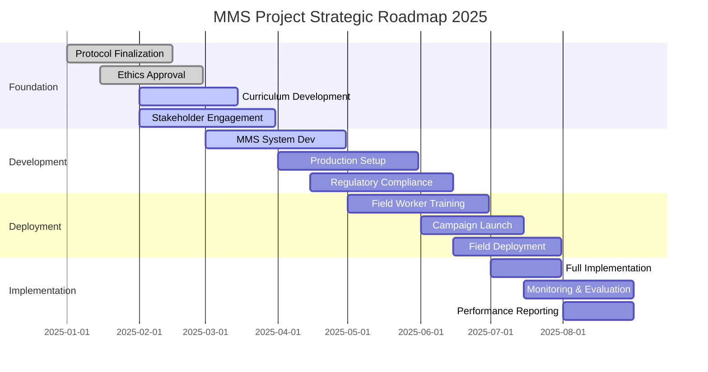

# MMS Project Strategic Plan 2025

## Executive Summary

The Multiple Micronutrient Supplementation (MMS) project represents a comprehensive healthcare initiative aimed at improving maternal and child health outcomes through innovative technology, systematic training, and evidence-based interventions. This strategic plan outlines our path forward, addressing current challenges and establishing clear priorities for successful project delivery.

## Strategic Vision

**Mission**: To establish a sustainable, scalable MMS delivery system that improves maternal nutrition outcomes through technology-enabled healthcare solutions and evidence-based protocols.

**Vision**: Become the leading model for maternal micronutrient supplementation programs in Indonesia, demonstrating measurable health improvements and operational excellence.

## Current State Analysis

### Progress Assessment
- **Overall Completion**: 0% (0 of 48 tasks completed)
- **Active Development**: 9 tasks in progress
- **Pending Initiation**: 38 tasks planned/not started
- **Project Phase**: Early preparation and development stage

### Key Achievements
- Project framework and task structure established
- Technology infrastructure development initiated (PWA, backend, dashboard)
- Stakeholder engagement framework defined

### Critical Challenges Identified
- **Timeline Compression**: All major deliverables targeted for Week 28
- **Resource Allocation**: Multiple parallel workstreams requiring coordination
- **Dependency Management**: Complex interdependencies between preparation, development, and deployment phases
- **Stakeholder Alignment**: Need for coordinated engagement across multiple government and healthcare entities

## Strategic Priorities

### Priority 1: Foundation Establishment (Weeks 1-8)
**Critical Path Activities**
- Protocol finalization with Sight and Life team
- Ethical clearance from University of Mataram
- Curriculum development and LMS deployment
- Stakeholder engagement and MoU establishment

**Success Metrics**
- Protocol approved and signed
- Ethics committee approval received
- Training materials ready for deployment
- Support letters secured from key partners

### Priority 2: System Development & Production (Weeks 9-16)
**Critical Path Activities**
- MMS system development and testing
- Field manual creation
- MMS production and packaging design
- Regulatory compliance (Halal, BPOM certification)

**Success Metrics**
- MMS system fully functional
- Production pipeline established
- All regulatory approvals secured
- Field manual completed and validated

### Priority 3: Field Deployment & Training (Weeks 17-24)
**Critical Path Activities**
- Field worker recruitment and training
- MMS kickoff campaign and webinar
- Field deployment coordination
- Baseline data collection initiation

**Success Metrics**
- Field workers trained and deployed
- Campaign successfully launched
- Initial enrollment targets met
- Data collection protocols established

### Priority 4: Implementation & Monitoring (Weeks 25-28)
**Critical Path Activities**
- Full-scale field implementation
- Continuous monitoring and evaluation
- Performance dashboard utilization
- Quarterly reporting initiation

**Success Metrics**
- Target population coverage achieved
- Monitoring systems operational
- Performance metrics tracked
- Initial results documented

## Strategic Roadmap

## Risk Management Strategy

### High-Risk Areas
1. **Regulatory Delays**
   - Risk: Ethics approval or regulatory compliance delays
   - Mitigation: Early engagement, parallel processing, contingency timelines

2. **Resource Constraints**
   - Risk: Insufficient field workers or technical capacity
   - Mitigation: Early recruitment, training programs, external partnerships

3. **Stakeholder Resistance**
   - Risk: Lack of support from key partners
   - Mitigation: Continuous engagement, benefit demonstration, relationship building

4. **Technology Integration**
   - Risk: System development delays or integration issues
   - Mitigation: Agile development, continuous testing, fallback systems

### Contingency Plans
- **Timeline Extension**: Prepare for 2-4 week buffer periods
- **Resource Backup**: Identify alternative suppliers and partners
- **Technology Alternatives**: Maintain manual processes as backup
- **Stakeholder Alternatives**: Develop multiple engagement pathways

## Resource Allocation Strategy

### Human Resources
- **Project Management**: Dedicated project manager with healthcare experience
- **Technical Development**: AI/ML specialists, full-stack developers, UX designers
- **Field Operations**: Healthcare professionals, community health workers
- **Quality Assurance**: Data analysts, healthcare quality specialists

### Technology Resources
- **Development Infrastructure**: Cloud-based development and testing environments
- **Data Management**: Secure, HIPAA-compliant data storage and processing
- **Mobile Applications**: Cross-platform PWA with offline capabilities
- **Analytics Platform**: Real-time dashboard and reporting systems

### Financial Resources
- **Development Phase**: 40% of total budget
- **Production & Deployment**: 35% of total budget
- **Implementation & Monitoring**: 20% of total budget
- **Contingency**: 5% of total budget

## Success Metrics & KPIs

### Health Outcomes
- **Coverage Rate**: Target 85% of eligible pregnant women
- **Compliance Rate**: Target 80% adherence to supplementation protocol
- **Health Improvements**: Measurable improvements in maternal micronutrient status

### Operational Excellence
- **Timeline Adherence**: 90% of milestones achieved on schedule
- **Resource Utilization**: 85% efficiency in resource allocation
- **Quality Metrics**: 95% satisfaction rate among healthcare workers

### Technology Performance
- **System Uptime**: 99.5% availability
- **Data Accuracy**: 98% data quality score
- **User Adoption**: 90% of field workers actively using the system

## Implementation Strategy

### Phase 1: Rapid Foundation (Weeks 1-8)
- **Week 1-2**: Protocol finalization and ethics submission
- **Week 3-4**: Curriculum development and stakeholder engagement
- **Week 5-6**: System architecture and development planning
- **Week 7-8**: Initial stakeholder agreements and resource mobilization

### Phase 2: Accelerated Development (Weeks 9-16)
- **Week 9-10**: Core system development and testing
- **Week 11-12**: Production planning and regulatory submissions
- **Week 13-14**: Field manual development and validation
- **Week 15-16**: Training material preparation and pilot testing

### Phase 3: Strategic Deployment (Weeks 17-24)
- **Week 17-18**: Field worker recruitment and initial training
- **Week 19-20**: Campaign preparation and stakeholder alignment
- **Week 21-22**: Pilot deployment and system validation
- **Week 23-24**: Full deployment preparation and resource positioning

### Phase 4: Full Implementation (Weeks 25-28)
- **Week 25**: Full-scale field implementation launch
- **Week 26**: Continuous monitoring and adjustment
- **Week 27**: Performance evaluation and optimization
- **Week 28**: Milestone achievement and next phase planning

## Stakeholder Engagement Strategy

### Government Partners
- **Ministry of Health**: Regular updates, policy alignment, support letter procurement
- **Provincial Health Offices**: Direct engagement, capacity building, resource coordination
- **District Health Offices**: Field-level coordination, local resource mobilization

### Healthcare Institutions
- **University of Mataram**: Ethics approval, research collaboration, academic validation
- **Local Healthcare Facilities**: Field implementation, data collection, quality assurance

### Technology Partners
- **Development Teams**: Agile collaboration, continuous integration, quality assurance
- **AI/ML Specialists**: Model optimization, performance tuning, accuracy improvement

## Communication & Reporting Strategy

### Internal Communication
- **Weekly Progress Reviews**: Project team status updates and issue resolution
- **Bi-weekly Stakeholder Updates**: Progress reports and milestone achievements
- **Monthly Executive Summaries**: Strategic overview and decision support

### External Communication
- **Quarterly Partner Reports**: Comprehensive progress and performance updates
- **Public Health Forums**: Knowledge sharing and best practice dissemination
- **Academic Publications**: Research findings and methodological contributions

## Next Steps & Immediate Actions

### This Week (Immediate)
1. **Protocol Finalization**: Complete Sight and Life team review and approval
2. **Ethics Submission**: Prepare and submit ethics clearance application
3. **Stakeholder Mapping**: Identify and prioritize key partner relationships
4. **Resource Planning**: Finalize resource allocation and procurement plans

### Next Two Weeks
1. **Curriculum Development**: Begin training material creation
2. **System Architecture**: Complete technical design and development planning
3. **Partner Engagement**: Initiate formal engagement with key stakeholders
4. **Risk Assessment**: Complete comprehensive risk analysis and mitigation planning

### Next Month
1. **Development Initiation**: Begin core system development
2. **Training Program**: Design and validate field worker training curriculum
3. **Production Planning**: Establish MMS production and distribution pipeline
4. **Quality Assurance**: Implement monitoring and evaluation frameworks

## Conclusion

The MMS project represents a significant opportunity to improve maternal health outcomes through innovative technology and systematic healthcare delivery. While the current timeline is ambitious, our strategic approach focuses on:

1. **Rapid Foundation Building**: Establishing critical protocols and stakeholder relationships
2. **Parallel Development**: Running multiple workstreams simultaneously
3. **Risk Mitigation**: Proactive identification and management of potential challenges
4. **Quality Focus**: Maintaining high standards while meeting aggressive timelines

Success depends on strong execution, effective stakeholder management, and continuous adaptation to emerging challenges. This strategic plan provides the framework for achieving our objectives while building a sustainable foundation for long-term impact.

---

*This strategic plan should be reviewed and updated monthly to reflect progress, challenges, and emerging opportunities.*
