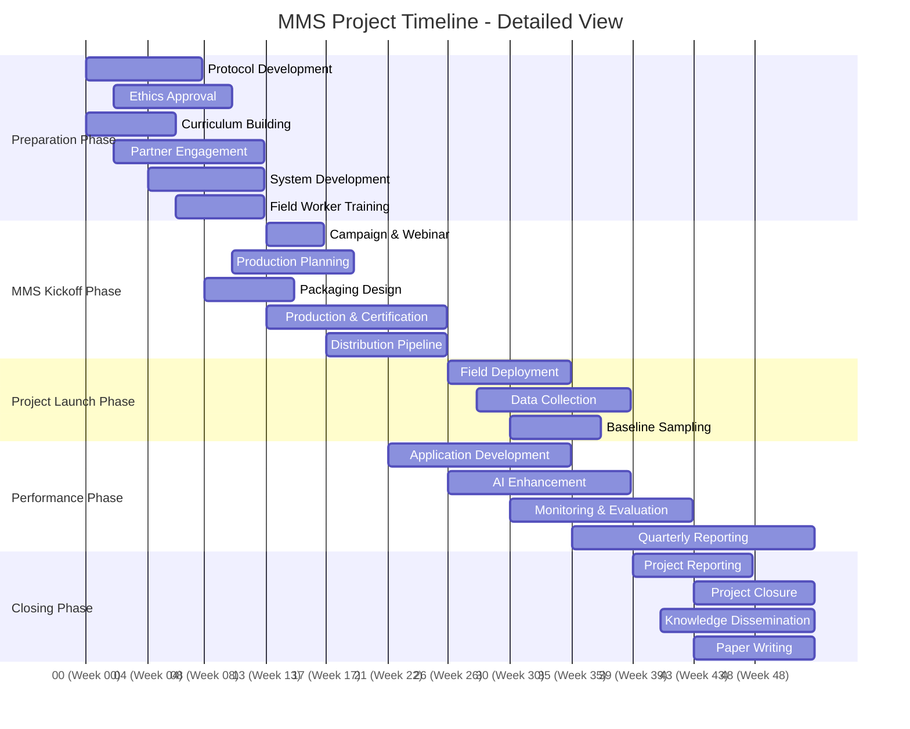
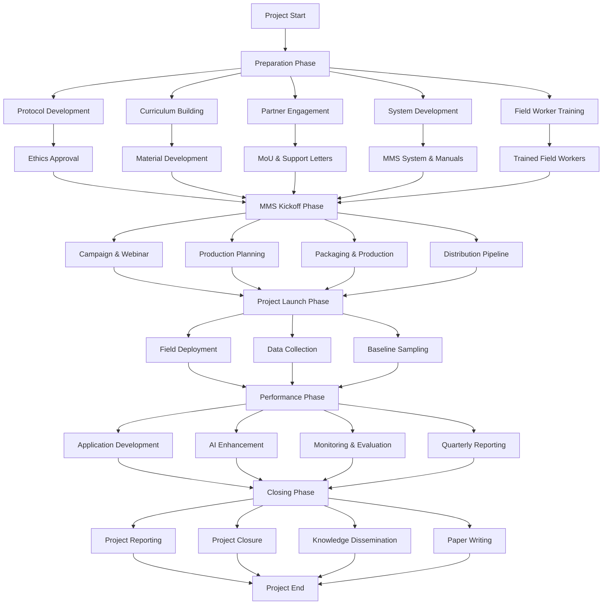
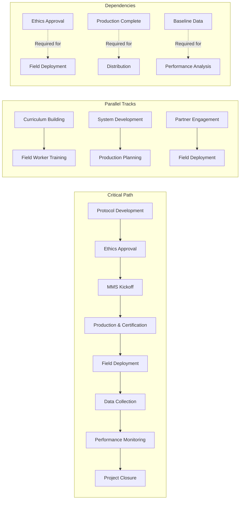

# MMS Project - Detailed Timeline Visualization

## Project Overview
The MMS (Multiple Micronutrient Supplementation) project is a comprehensive healthcare initiative involving protocol development, curriculum building, system development, field deployment, and performance monitoring. This document provides detailed timeline analysis and visualizations.

## Project Phases & Structure

### Phase 1: Preparation & Foundation (Weeks 1-8)
**Color Code: FF0B5394 (Phase Header)**

#### 1.1 Protocol Development & Ethics
- **Task 2**: Share and finalise protocol with Sight and Life team
- **Task 3**: Sending and process for ethical clearance to University of Mataram  
- **Task 4**: Receive ethic approval

#### 1.2 Curriculum Building
- **Task b**: Curriculum Building
- **Task 2**: Engage with MoH or Bapelkes
- **Task 3**: Modules and material making
- **Task 4**: Materials deployment to the LMS

#### 1.3 Partner Engagement & Advocacy
- **Task c**: Approach, advocate and discuss with partners in districts and national levels
- **Task 2**: Secure support letters/MoUs from districts and related partners at provincial/national levels
- **Task 3**: Meet, discuss, and advocate with stakeholders for MMS system

#### 1.4 System Development
- **Task d**: Population estimation
- **Task e**: Develop MMS System
- **Task 2**: Create Field Manual

#### 1.5 Field Worker Preparation
- **Task f**: Recruit and train field worker
- **Task 2**: Field worker (CHP) training

### Phase 2: MMS Kickoff (Weeks 9-12)
**Color Code: FF38761D (Phase Header)**

#### 2.1 Campaign & Communication
- **Task**: MMS Kickoff
- **Task 2**: Campaign
- **Task 3**: Host the webinar

#### 2.2 Production Planning
- **Task b**: MMS Blister and Kapsul preparation and Production
- **Task 2**: Design MMS packaging (Bottle, strips, and pill design)
- **Task 3**: Determine batch release and expired date
- **Task 4**: Production MMS batch
- **Task 5**: Secure exemption, Halal Certification, and BPOM

#### 2.3 Distribution Pipeline
- **Task c**: MMS storage and distribution pipeline
- **Task 2**: Define SOP for storage and distribution to pregnant women

### Phase 3: Project Launch & Deployment (Weeks 13-20)
**Color Code: FFB45F06 (Phase Header)**

#### 3.1 Field Deployment
- **Task**: Project Launch, Deployment and Upscaling
- **Task 2**: Prepopulation to Polindes
- **Task 3**: Prepopulation data monitoring

#### 3.2 Field Coordination
- **Task b**: Coordinate Field Deployment
- **Task 2**: Home Visit: Enrollment and Subsampling Baseline

#### 3.3 Monitoring & Data Collection
- **Task c**: Monitoring
- **Task 2**: Sampling Midline
- **Task 3**: Sampling endline

### Phase 4: Project Performance & Control (Weeks 21-28)
**Color Code: FF351C75 (Phase Header)**

#### 4.1 Data-Driven Decision Making
- **Task**: Project Performance & Control
- **Task 2**: Create manuals and processes for data-driven decisions via interpretation of dashboards for action

#### 4.2 Application & AI Development
- **Task b**: Application and AI development
- **Task 2**: Application enhancement

#### 4.3 Monitoring & Evaluation
- **Task c**: Monitor and evaluate the implementation of MMS project
- **Task 2**: Report quarterly summaries for coverage and quality of care, and the Head, Heart, Hand score for each FHW

### Phase 5: Reporting & Project Closing (Weeks 29-30)
**Color Code: FFF2F2F2 (Planning)**

#### 5.1 Reporting
- **Task**: Report and Project Closing
- **Task 2**: Half year report to Partner
- **Task 3**: Half year report Meeting to DHO

#### 5.2 Project Closure
- **Task b**: Project Closing
- **Task 2**: Dissemination of project result

#### 5.3 Knowledge Management
- **Task c**: Paper Writing
- **Task 2**: Paper Writing

## Detailed Timeline Visualization

### Gantt Chart (Mermaid)

### Project Flow Diagram (Mermaid)

### Dependencies & Critical Path

## Risk Analysis & Assumptions

### High-Risk Items
1. **Ethics Approval Delays**: Could delay entire project timeline
2. **Production & Certification**: BPOM, Halal certification delays
3. **Field Worker Recruitment**: Training and deployment challenges
4. **Data Collection**: Field implementation and compliance issues

### Key Assumptions
1. **Timeline**: 30-week project duration (Q1-Q4 2025)
2. **Resources**: Adequate funding and personnel availability
3. **Stakeholder Support**: Continued government and partner engagement
4. **Technology**: AI/ML system development progresses as planned

### Mitigation Strategies
1. **Early Ethics Submission**: Submit ethics application immediately
2. **Parallel Processing**: Run preparation activities concurrently
3. **Stakeholder Management**: Regular communication and updates
4. **Contingency Planning**: Buffer time for critical path activities

## Status Tracking

### Current Status Distribution
- **Not Started/Planned**: 38 tasks (79.2%)
- **In Progress (Extended)**: 7 tasks (14.6%)
- **In Progress (Performance)**: 2 tasks (4.2%)
- **Holiday/Break**: 1 task (2.1%)

### Completion Rate: 0.0%

## Next Steps & Recommendations

1. **Immediate Actions**:
   - Submit ethics application to University of Mataram
   - Begin protocol finalization with Sight and Life team
   - Initiate partner engagement and MoU discussions

2. **Week 1-4 Priorities**:
   - Complete protocol development
   - Start curriculum building
   - Begin partner engagement

3. **Week 5-8 Priorities**:
   - Complete ethics approval process
   - Finish curriculum and materials
   - Begin system development

4. **Risk Monitoring**:
   - Track ethics approval timeline
   - Monitor stakeholder engagement
   - Assess resource availability

---

*This detailed timeline visualization provides comprehensive project planning and tracking capabilities for the MMS project team.*
