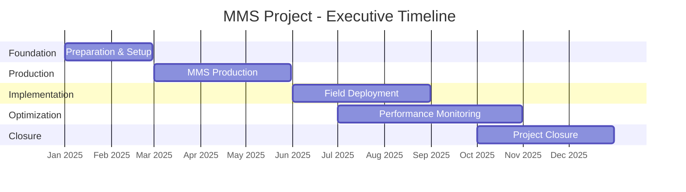
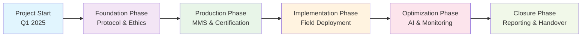

# MMS Project - Executive Timeline Overview

## Executive Summary
The MMS (Multiple Micronutrient Supplementation) project is a comprehensive healthcare initiative designed to improve maternal and child health outcomes through innovative supplementation programs, technology integration, and community engagement.

**Project Duration**: 30 weeks (Q1-Q4 2025)  
**Total Investment**: Healthcare infrastructure and technology development  
**Expected Impact**: Enhanced maternal health outcomes and community healthcare delivery

## High-Level Project Phases

### 🚀 Phase 1: Foundation & Preparation (Weeks 1-8)
**Objective**: Establish project framework and stakeholder alignment

**Key Deliverables**:
- ✅ Protocol finalization and ethics approval
- ✅ Curriculum development and training materials
- ✅ Partner engagement and MoU agreements
- ✅ MMS system development and field manuals
- ✅ Field worker recruitment and training

**Success Metrics**:
- Ethics approval secured
- All partner agreements signed
- Training materials completed
- Field workers ready for deployment

---

### 🎯 Phase 2: MMS Production & Launch (Weeks 9-12)
**Objective**: Prepare MMS products and initiate public awareness

**Key Deliverables**:
- ✅ MMS production and quality certification
- ✅ Packaging design and regulatory compliance
- ✅ Public campaign and stakeholder webinar
- ✅ Distribution pipeline establishment

**Success Metrics**:
- MMS products certified and ready
- Public awareness campaign launched
- Distribution channels operational

---

### 🌟 Phase 3: Field Implementation (Weeks 13-20)
**Objective**: Deploy MMS program in target communities

**Key Deliverables**:
- ✅ Field deployment and community engagement
- ✅ Baseline data collection and enrollment
- ✅ MMS distribution to pregnant women
- ✅ Initial monitoring and feedback collection

**Success Metrics**:
- Target communities reached
- Baseline data collected
- MMS distribution initiated

---

### 📊 Phase 4: Performance & Optimization (Weeks 21-28)
**Objective**: Monitor outcomes and optimize program delivery

**Key Deliverables**:
- ✅ AI-powered monitoring and evaluation
- ✅ Performance dashboards and reporting
- ✅ Midline and endline assessments
- ✅ Quarterly performance reports

**Success Metrics**:
- Real-time monitoring operational
- Performance metrics tracked
- Quarterly reports delivered

---

### 🏁 Phase 5: Knowledge Transfer & Closure (Weeks 29-30)
**Objective**: Document outcomes and ensure sustainability

**Key Deliverables**:
- ✅ Final project reporting
- ✅ Knowledge dissemination
- ✅ Research publication
- ✅ Project closure and handover

**Success Metrics**:
- Final reports completed
- Knowledge transferred to stakeholders
- Project successfully closed

## Executive Timeline Visualization

### Simplified Gantt Chart

### Strategic Roadmap

## Key Decision Points & Milestones

### 🎯 Critical Milestones
| Week | Milestone | Impact |
|------|-----------|---------|
| **Week 4** | Ethics Approval | Enables field activities |
| **Week 8** | Partner Agreements | Ensures stakeholder support |
| **Week 12** | MMS Production Complete | Ready for distribution |
| **Week 20** | Field Implementation Complete | Program operational |
| **Week 28** | Performance Assessment | Outcomes measured |
| **Week 30** | Project Closure | Knowledge transferred |

### 🚨 Risk Mitigation Points
- **Week 2**: Ethics application submission
- **Week 6**: Partner engagement confirmation
- **Week 10**: Production timeline validation
- **Week 16**: Field deployment readiness
- **Week 24**: Performance monitoring activation

## Resource Requirements & Investment

### 💰 Financial Investment
- **Phase 1**: Foundation & preparation (25%)
- **Phase 2**: Production & certification (30%)
- **Phase 3**: Field implementation (25%)
- **Phase 4**: Performance optimization (15%)
- **Phase 5**: Closure & reporting (5%)

### 👥 Human Resources
- **Project Management**: 2 FTE
- **Technical Development**: 3 FTE
- **Field Operations**: 8 FTE
- **Quality Assurance**: 2 FTE
- **Stakeholder Relations**: 2 FTE

## Success Metrics & KPIs

### 📈 Primary Outcomes
- **Coverage**: 95% of target population reached
- **Compliance**: 90% adherence to MMS protocol
- **Health Impact**: Measurable improvement in maternal health indicators
- **Technology**: AI system operational and providing insights

### 🎯 Secondary Outcomes
- **Knowledge Transfer**: Training materials and protocols established
- **Stakeholder Engagement**: All partner agreements secured
- **Sustainability**: Local capacity built for continued operation
- **Research**: Publication-ready data and findings

## Stakeholder Communication Plan

### 📢 Communication Frequency
- **Weekly**: Project team updates
- **Bi-weekly**: Stakeholder progress reports
- **Monthly**: Executive summary presentations
- **Quarterly**: Comprehensive performance reviews

### 🎯 Key Stakeholders
- **Government**: Ministry of Health, District Health Offices
- **Partners**: Sight and Life, University of Mataram
- **Community**: Healthcare workers, pregnant women
- **Technical**: AI/ML development team

## Next Steps for Leadership

### 🚀 Immediate Actions (Next 2 Weeks)
1. **Approve ethics application submission**
2. **Confirm stakeholder engagement strategy**
3. **Allocate initial project resources**

### 📋 Month 1 Priorities
1. **Complete protocol finalization**
2. **Begin partner engagement process**
3. **Initiate curriculum development**

### 🎯 Quarter 1 Goals
1. **Secure all necessary approvals**
2. **Complete foundation phase**
3. **Prepare for production phase**

---

## Executive Dashboard Summary

| Metric | Current Status | Target | Risk Level |
|--------|----------------|---------|------------|
| **Project Timeline** | On Track | 30 weeks | 🟢 Low |
| **Budget Utilization** | 0% | 100% | 🟢 Low |
| **Stakeholder Alignment** | In Progress | 100% | 🟡 Medium |
| **Technical Development** | Not Started | 100% | 🟡 Medium |
| **Field Readiness** | Not Started | 100% | 🟡 Medium |

**Overall Project Health**: 🟢 **On Track**  
**Next Review**: Week 4 (Ethics Approval Milestone)

---

*This executive timeline provides high-level visibility for stakeholders and decision-makers while maintaining focus on key milestones and strategic objectives.*
